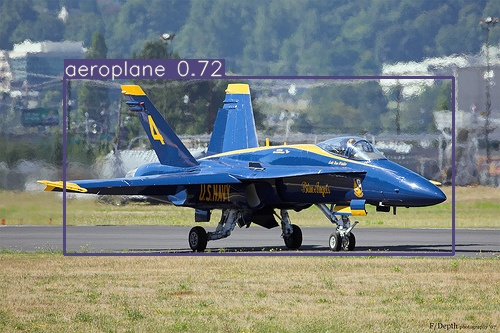
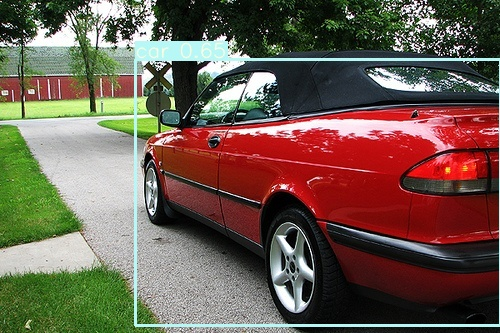

# Introduction

This directory contains PyTorch YOLOv3 implementation towards ECE-285 Final Project on Multi-Object Detection. 

# Description
The repo contains inference and training code for YOLOv3 in PyTorch. Training is done on the VOCPascal dataset: http://host.robots.ox.ac.uk/pascal/VOC/

# Requirements
Python 3.7 or later with the following `pip3 install -U -r requirements.txt` packages:

- `numpy`
- `torch >= 1.1.0`
- `opencv-python`
- `tqdm`

# Training

**Start Training:** 
- `python train.py --data data_voc/2012_train.data --cfg cfg/yolov3-voc.cfg --img-size <> --epochs <>`

**Resume Training:**
- `python3 train.py --resume` to resume training from `weights/last.pt`.

## demo
- `python detect.py --source <file.jpg> --data data_voc/2012_train.data --cfg cfg/yolov3-voc.cfg --weights <>`

    

## mAP calculation/Inference
- `python test.py --data data_voc/2012_train.data --cfg cfg/yolov3-voc.cfg --img-size <> --epochs <>` 

## Google Drive Links to pre-trained models
`YOLOv3 weights`

Default: https://drive.google.com/open?id=1lU7vbVZewn6Up9O2NUYyYV1gQWXEMMtl

Our Anchor Estimation and Focal Loss: https://drive.google.com/open?id=1LMZeOA9onrqVLWXFYngx19tSxb4WvpAK

With Deformable Convolution: https://drive.google.com/open?id=14QVmdsUUK4SjH3859Rf41odAwVd5Czha

`CenterNet wieghts`

DLA-34 (With Deformable Convolution): https://drive.google.com/open?id=1lAdwRHdHxRjFGl8Zz16BSGG1r8lQK2v0

ResNet-101 (Without Deformable Convolution): https://drive.google.com/open?id=1suaTpGWqjucCDr9H2J7KtVIqxHnPCT95

ResNet-101 (With Deformable Convolution): https://drive.google.com/open?id=1d9hX7TlNUtewjwvtSwwsSMZf5urfU1Y2

## Image Augmentation

`datasets.py` applies random OpenCV-powered (https://opencv.org/) augmentation to the input images in accordance with the following specifications. Augmentation is applied **only** during training, not during inference. Bounding boxes are automatically tracked and updated with the images. 416 x 416 examples pictured below.

Augmentation | Description
--- | ---
Translation | +/- 10% (vertical and horizontal)
Rotation | +/- 5 degrees
Reflection | 50% probability (horizontal-only)
H**S**V Saturation | +/- 50%
HS**V** Intensity | +/- 50%

# Credits
This repository is forked from https://github.com/ultralytics/yolov3.

The Deformable Convolution respository is forked from https://github.com/CharlesShang/DCNv2.

**Credit to Joseph Redmon for YOLO:** https://pjreddie.com/darknet/yolo/.

